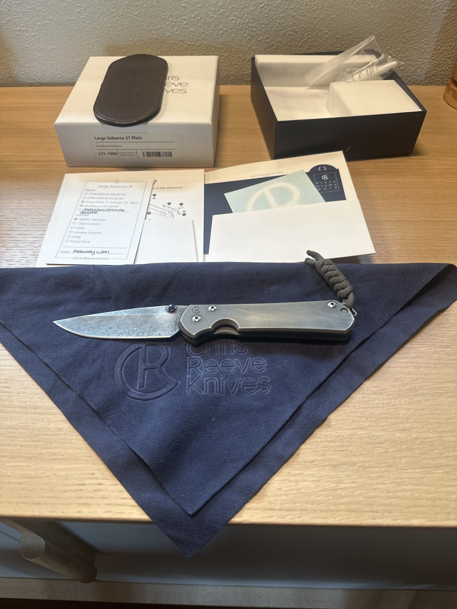
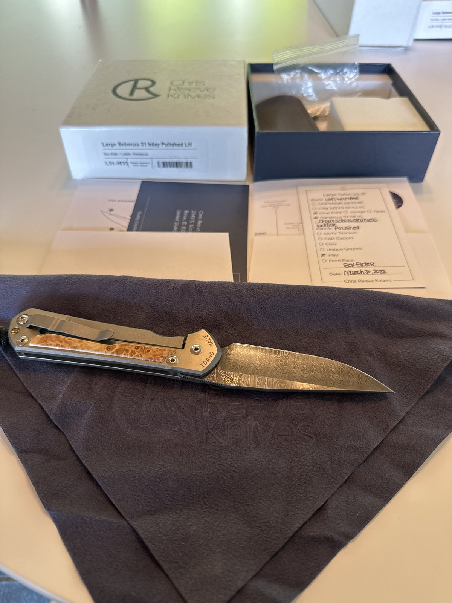

# bladebook

Photos-first knife-collection tracking, built around the birth card. Two photos per knife in — a searchable private catalog and a leak-proof shareable index out.

<table>
<tr>
<td width="50%"></td>
<td width="50%"></td>
</tr>
</table>

*(Example knives from the seed data — see Quickstart below.)*

## Philosophy

This is a collection, not a store. The card is the artifact: most custom and semi-custom knives don't carry serials, so the birth card and box label are the record of what a piece actually is — bladebook exists to get that information off a photo and into something you can search. It's private by default, with exactly one deliberately whitelisted public surface, because a collector's own notes (what something cost, where it came from, where it lives) are nobody else's business, while the knife itself is worth sharing. And it's anti-sticky: get a batch of knives in, record them, get out. No feed to check, no engagement loop, no reason to open it if nothing changed.

## How it works

```
phone photos → AI decode → seed list → SQLite → publish → three views
                                                   (uploader / private catalog / public index)
```

**Phone photos.** Two photos per knife — the box label and the birth card — are usually enough to capture everything: model, generation, steel, handle treatment, born-on date, and the maker's own SKU if the box has one.

**AI decode.** An AI assistant reads the photos and turns handwriting and box-label shorthand into structured fields — no manual data entry.

**Seed list.** The decoded knives land as a plain Python list, easy to review and correct before anything touches the database.

**SQLite.** One `bladebook.db` file holds three tables: models, knives, and events. Every knife gets a permanent tag (K01, K02, …) the moment it's seeded.

**Publish.** A regeneration step builds the public bundle from scratch — a static, whitelisted export, never a live view of the database.

**Three views.** The uploader takes new photos in by tag. The private catalog is the full searchable record, yours alone. The public index is what you'd hand a fellow collector: knife, generation, steel, story — nothing else.

## Bring your own Claude

The intake pipeline is an AI assistant reading your photos. Grab [Claude](https://claude.ai) and set up Claude Code on your PC or laptop, point it at this repo, and tell it a batch of photos landed — `AI.md` teaches it the whole loop: read the box label and birth card, decode them into the seed list, seed, publish, and report back. Any capable model works; nothing here is Claude-specific.

## Quickstart

```bash
pip install -r requirements.txt
python3 scripts/seed_example.py
python3 scripts/publish.py
python3 app.py
```

Then visit:

- `/` — uploader (photo intake by tag)
- `/catalog/?key=…` — private catalog (full record, needs the admin token)
- `/public/` — public index (whitelisted, shareable)

### Environment variables

| Variable | Default | Purpose |
|---|---|---|
| `BLADEBOOK_DATA_DIR` | `./data` | SQLite DB + archived original photos |
| `BLADEBOOK_PUBLIC_DIR` | `./public` | Generated public bundle (written by `publish.py`) |
| `BLADEBOOK_ADMIN_TOKEN` | — | Required for the uploader, catalog, and API — pass as `?key=` or `X-Bladebook-Token` |
| `BLADEBOOK_HOST` | `127.0.0.1` | Host `app.py` binds to |
| `BLADEBOOK_PORT` | `5000` | Port `app.py` binds to |

## Privacy

The public export is whitelist-only: `bladebook/export.py` lists exactly which fields are allowed out, and everything else is dropped by construction. `price_paid`, `acquired_from`, `location`, private notes, and condition notes can never appear in the public bundle — they aren't on the whitelist, so there's no field to accidentally leave in. `asking_price` is the one exception with a rule attached: it only surfaces when a knife's `sale_status` is `for_sale`. `tests/test_export.py` enforces all of this — it seeds a knife with every private field populated and asserts the public bundle doesn't contain them, not even as null. Photos are re-encoded on publish, which drops EXIF/GPS data along with everything else not on the whitelist.

## Data model

Three tables: models (a manufacturer configuration — family, model, generation, size, blade shape), knives (one physical, individually tagged knife, tied to a model), and events (a knife's history — acquired, photographed, sold, and so on). The tag (K01, K02, …) is the only key that matters day to day; duplicate configs are real and expected — two knives can share a model and still be two separate rows. Maker-specific fields like `crk_sku` are optional and live on the knife, not the model, since box-label SKUs turn out to vary by configuration rather than by model line.

## Roadmap

- Edit UI for the private catalog (currently: seed script + direct DB access)
- Generic collectibles schema, so bladebook isn't knife-specific
- UPC decode table, to pull known fields straight from a box barcode

## License

MIT — see [LICENSE](LICENSE).
